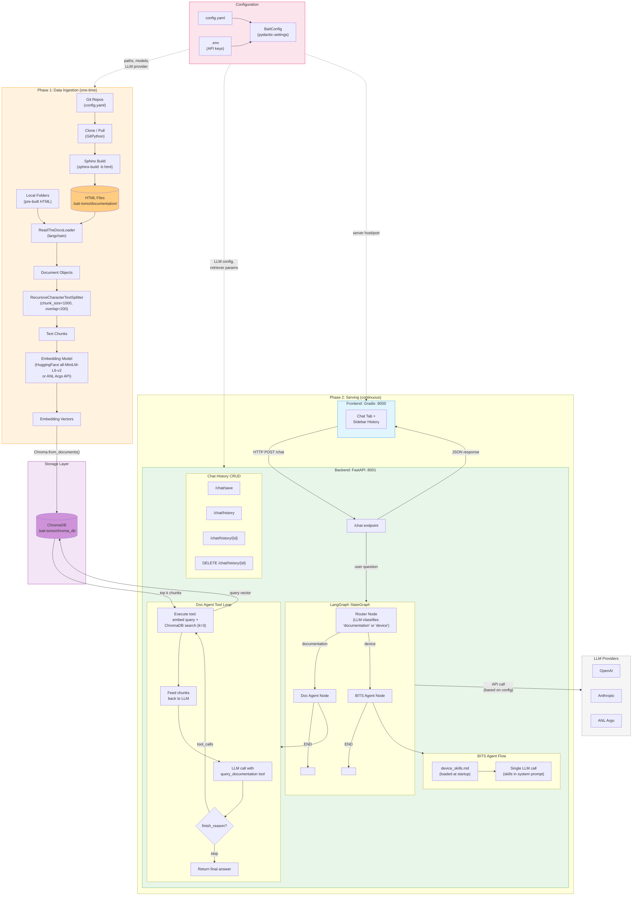
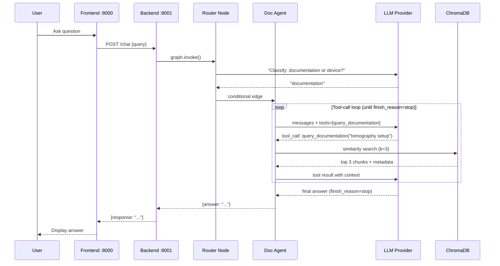

# TomoBait

A RAG (Retrieval-Augmented Generation) system for tomography beamline documentation at the Advanced Photon Source (APS). TomoBait ingests Sphinx documentation, indexes it in a vector database, and provides an AI-powered conversational interface for querying beamline documentation.

## Features

- **Multi-Source Documentation**: Index from Git repositories and local folders
- **AI-Powered Q&A**: Ask questions in natural language and get accurate answers from documentation
- **Multi-Agent Routing**: LangGraph-based router dispatches questions to specialized agents (documentation or device)
- **Multiple LLM Providers**: Support for OpenAI, Anthropic, and ANL Argo (OpenAI-compatible)
- **Chat History**: Save, load, and manage conversation sessions
- **Web Interface**: Gradio-based chat UI with sidebar history

## Architecture



## Quick Start

### Prerequisites

- Python 3.12
- [uv](https://github.com/astral-sh/uv) package manager

### Installation

1. **Clone the repository**
```bash
git clone <repository-url>
cd tomo-bait
```

2. **Create a virtual environment and install dependencies**
```bash
uv venv
uv pip install -e .
```

3. **Configure API key**

Edit `config.yaml` and set your ANL username as `api_key` under each agent:
```yaml
agents:
  router:
    api_key: your_anl_username
  doc_agent:
    api_key: your_anl_username
  bits_agent:
    api_key: your_anl_username
```

4. **Ingest documentation** (first time only)
```bash
uv run python -m tomobait.data_ingestion
```

5. **Start the application**
```bash
# Terminal 1: Start backend
uv run start-backend

# Terminal 2: Start frontend
uv run start-frontend
```

6. **Access the UI**

Open your browser to `http://localhost:8000`

## Configuration

TomoBait uses a centralized `config.yaml` file, loaded via pydantic-settings.

### Configuration Sections

```yaml
project:
  name: tomo
  data_dir: .bait-tomo

documentation:
  git_repos:
    - https://github.com/xray-imaging/2bm-docs.git
  local_folders: []

retriever:
  k: 3
  search_type: similarity

embedding:
  provider: huggingface
  model: sentence-transformers/all-MiniLM-L6-v2
  device: cpu

agents:
  router:
    model: claudeopus46
    api_type: anthropic
    api_key: your_anl_username
    argo_base_url: https://apps.inside.anl.gov/argoapi/v1
    system_prompt: "Classify as 'documentation' or 'device'."
  doc_agent:
    model: claudeopus46
    api_type: anthropic
    api_key: your_anl_username
    argo_base_url: https://apps.inside.anl.gov/argoapi/v1
    system_prompt: "You are a documentation expert..."
  bits_agent:
    model: claudeopus46
    api_type: anthropic
    api_key: your_anl_username
    argo_base_url: https://apps.inside.anl.gov/argoapi/v1
    system_prompt: "You are a beamline device expert..."

text_processing:
  chunk_size: 1000
  chunk_overlap: 200

server:
  backend_host: 127.0.0.1
  backend_port: 8001
  frontend_host: 0.0.0.0
  frontend_port: 8000
```

### Switching API Protocol

Each agent can use either the Anthropic Messages API or OpenAI Chat Completions API. Both are supported by ANL Argo.

**Anthropic protocol** (default)
```yaml
agents:
  doc_agent:
    model: claudeopus46
    api_type: anthropic
    api_key: your_anl_username
    argo_base_url: https://apps.inside.anl.gov/argoapi/v1
```

**OpenAI protocol**
```yaml
agents:
  doc_agent:
    model: gpt4o
    api_type: openai
    api_key: your_anl_username
    argo_base_url: https://apps.inside.anl.gov/argoapi/v1
```

Each agent is configured independently, so you can mix protocols per agent.

## Available Commands

```bash
# Running
uv run start-backend                      # Start FastAPI backend (port 8001)
uv run start-frontend                     # Start Gradio frontend (port 8000)

# Data Management
uv run python -m tomobait.data_ingestion  # Ingest documentation into vector DB

# Testing
uv run pytest                             # Run test suite
uv run pytest --cov=tomobait              # Run with coverage

# Code Quality
uv run ruff check .                       # Check code style
uv run ruff format .                      # Format code
```

## Modules

| Module | Description |
|--------|-------------|
| `config.py` | Centralized configuration via pydantic-settings. Provides `BaitConfig` with computed paths and per-agent LLM settings. |
| `utils.py` | Shared factories: `get_embeddings()` for embedding models, `build_llm_client()` for cached OpenAI/Anthropic clients, `llm_chat()` SDK-agnostic wrapper, `build_tool_result_messages()` for tool results. |
| `data_ingestion.py` | Clones Git repos, builds Sphinx docs, chunks text, embeds, and stores in ChromaDB. |
| `retriever.py` | Shared utility for querying ChromaDB. Returns top-k relevant document chunks. |
| `agents.py` | LangGraph StateGraph with router, doc_agent, and bits_agent nodes. Routes questions and orchestrates tool calling. |
| `app.py` | FastAPI server: `/chat` endpoint, `/config` endpoints, and chat history CRUD (`/chat/save`, `/chat/history`, `/chat/delete`). |
| `frontend.py` | Gradio chat interface with sidebar history management. Sends questions to backend and displays responses. |

## API Endpoints

| Method | Path | Description |
|--------|------|-------------|
| POST | `/chat` | Send a question, get an agent response |
| GET | `/config` | Read current configuration |
| POST | `/config` | Update configuration (placeholder) |
| POST | `/chat/save` | Save or update a conversation |
| GET | `/chat/history` | List saved chats (metadata only) |
| GET | `/chat/history/{chat_id}` | Load a full conversation |
| DELETE | `/chat/history/{chat_id}` | Delete a saved conversation |

## Request Flow



## Project Data Directory

All data is stored under `.bait-{project.name}/` (default: `.bait-tomo/`):

```
.bait-tomo/
  chroma_db/          # Vector database
  documentation/      # Cloned repos and built docs
  chat_history/       # Saved conversation JSON files
  bits_skills/        # Device skills reference files
```

## Contributing

### Code Style

- Ruff for linting and formatting (config in `ruff.toml`)
- Line length: 88 characters
- Double quotes, space indentation

### Development Workflow

1. Make changes
2. Run `uv run ruff format .` to format code
3. Run `uv run ruff check .` to check style
4. Run `uv run pytest` to run tests
5. Commit and push

## Acknowledgments

- Advanced Photon Source (APS) at Argonne National Laboratory
- 2-BM beamline team
- TomoPy and related open-source projects

## Troubleshooting

### Backend won't start
- Check that your LLM API key is set in `.env` (e.g., `OPENAI_API_KEY`)
- Verify ChromaDB exists: run `uv run python -m tomobait.data_ingestion` if needed

### Frontend can't connect
- Ensure backend is running on port 8001
- Check firewall settings

### No documents retrieved
- Verify project data directory exists (e.g., `.bait-tomo/`)
- Re-run ingestion: `uv run python -m tomobait.data_ingestion`
- Check that the embedding model/provider matches between ingestion and retrieval
