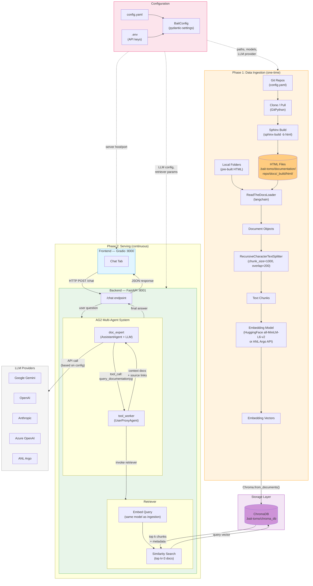
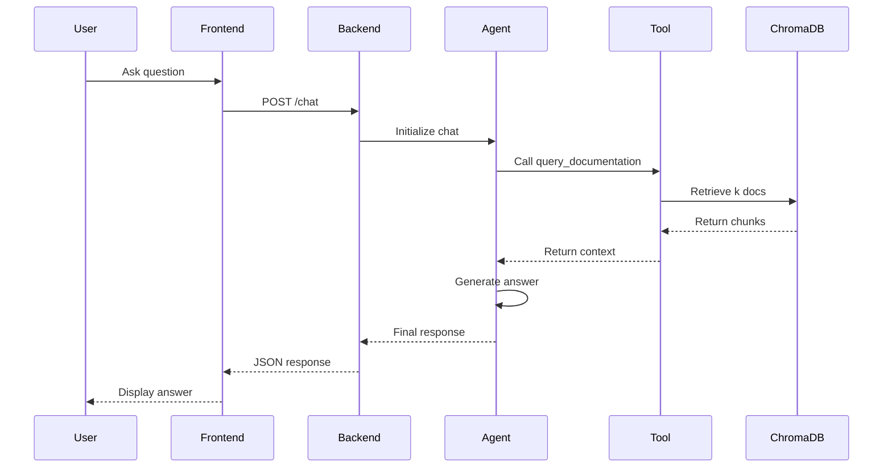

# TomoBait

A RAG (Retrieval-Augmented Generation) system for tomography beamline documentation at the Advanced Photon Source (APS). TomoBait ingests Sphinx documentation, indexes it in a vector database, and provides an AI-powered conversational interface for querying beamline documentation.

## Features

- **Multi-Source Documentation**: Index from Git repositories and local folders
- **AI-Powered Q&A**: Ask questions in natural language and get accurate answers from documentation
- **Multiple LLM Providers**: Support for Gemini, OpenAI, Anthropic, Azure, and ANL Argo
- **Web Interface**: Gradio-based chat UI

## Architecture



## Quick Start

### Prerequisites

- Python 3.12
- [uv](https://github.com/astral-sh/uv) package manager

### Installation

1. **Clone the repository**
```bash
git clone <repository-url>
cd tomo-bait
```

2. **Create a virtual environment and install dependencies**
```bash
uv venv
uv pip install -e .
```

3. **Set up environment variables**

Create a `.env` file with your API key:
```bash
GEMINI_API_KEY=your_key_here
# Or whichever provider you're using: OPENAI_API_KEY, ANTHROPIC_API_KEY, etc.
```

4. **Ingest documentation** (first time only)
```bash
uv run python -m tomobait.data_ingestion
```

5. **Start the application**
```bash
# Terminal 1: Start backend
uv run start-backend

# Terminal 2: Start frontend
uv run start-frontend
```

6. **Access the UI**

Open your browser to `http://localhost:8000`

## Configuration

TomoBait uses a centralized `config.yaml` file, loaded via pydantic-settings.

### Configuration Sections

```yaml
project:
  name: tomo                # Project identifier (used in directory naming)
  data_dir: .bait-tomo      # Base directory for all project data

documentation:
  git_repos:                # List of Git repository URLs
    - https://github.com/xray-imaging/2bm-docs.git
  local_folders: []         # List of local folder paths

retriever:
  k: 3                     # Number of documents to retrieve
  search_type: similarity   # similarity, mmr, or similarity_score_threshold
  score_threshold: null

embedding:
  provider: huggingface     # 'huggingface' (local) or 'anl_argo'
  model: sentence-transformers/all-MiniLM-L6-v2
  device: cpu

llm:
  provider: GEMINI_API_KEY  # Environment variable name for API key
  model: gemini-2.5-flash   # Model name
  api_type: google          # google, openai, anthropic, azure

text_processing:
  chunk_size: 1000          # Text chunk size (100-5000)
  chunk_overlap: 200        # Overlap between chunks (0-1000)

server:
  backend_host: 127.0.0.1
  backend_port: 8001
  frontend_host: 0.0.0.0
  frontend_port: 8000
```

### Switching LLM Providers

Switch providers by editing `config.yaml`:

**Gemini (Default)**
```yaml
llm:
  provider: GEMINI_API_KEY
  model: gemini-2.5-flash
  api_type: google
```

**OpenAI**
```yaml
llm:
  provider: OPENAI_API_KEY
  model: gpt-4
  api_type: openai
```

**Anthropic (Claude)**
```yaml
llm:
  provider: ANTHROPIC_API_KEY
  model: claude-3-opus
  api_type: anthropic
```

**ANL Argo** (Internal LLM service)
```yaml
llm:
  provider: anl_argo
  api_key: your_anl_username
  model: claudeopus46
  api_type: openai
  argo_base_url: https://apps-dev.inside.anl.gov/argoapi/v1/
```

## Available Commands

```bash
# Running
uv run start-backend                    # Start FastAPI backend (port 8001)
uv run start-frontend                   # Start Gradio frontend (port 8000)

# Data Management
uv run python -m tomobait.data_ingestion  # Ingest documentation into vector DB

# Code Quality
ruff check .                            # Check code style
ruff format .                           # Format code
```

## System Architecture

### Modules

| Module | Description |
|--------|-------------|
| `config.py` | Centralized configuration via pydantic-settings, loaded from `config.yaml`. Provides `BaitConfig` and shared `get_embeddings()` factory. |
| `data_ingestion.py` | Clones Git repos, builds Sphinx docs, chunks text, embeds, and stores in ChromaDB. |
| `retriever.py` | Shared utility for querying ChromaDB. Returns top-k relevant document chunks. |
| `agents.py` | Defines the AG2 two-agent system (`doc_expert` + `tool_worker`) and the `query_documentation` tool. |
| `app.py` | FastAPI server exposing `/chat` endpoint. Bridges HTTP requests to the agent system. |
| `frontend.py` | Gradio chat interface. Sends questions to the backend and displays responses. |

### Request Flow



### Project Data Directory

All data is stored under `.bait-{project.name}/` (default: `.bait-tomo/`):

```
.bait-tomo/
  chroma_db/          # Vector database
  documentation/      # Cloned repos and built docs
```

## Contributing

### Code Style

- Ruff for linting and formatting
- Line length: 88 characters
- Double quotes, space indentation

### Development Workflow

1. Make changes
2. Run `ruff format .` to format code
3. Run `ruff check .` to check style
4. Test changes locally
5. Commit and push

## License

[Add your license here]

## Acknowledgments

- Advanced Photon Source (APS) at Argonne National Laboratory
- 2-BM beamline team
- TomoPy and related open-source projects

## Troubleshooting

### Backend won't start
- Check that `GEMINI_API_KEY` (or your chosen provider's key) is set in `.env`
- Verify ChromaDB exists: run `uv run python -m tomobait.data_ingestion` if needed

### Frontend can't connect
- Ensure backend is running on port 8001
- Check firewall settings

### No documents retrieved
- Verify project data directory exists (e.g., `.bait-tomo/`)
- Re-run ingestion: `uv run python -m tomobait.data_ingestion`
- Check that the embedding model/provider matches between ingestion and retrieval (both must use the same config)
